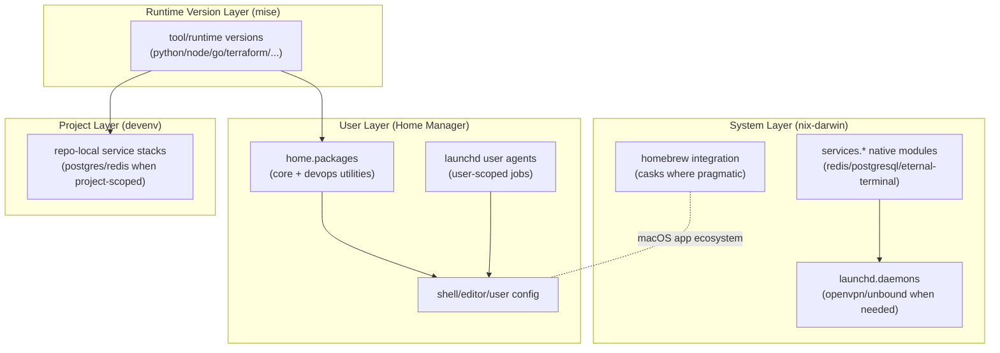
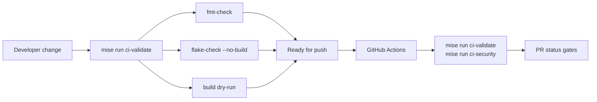
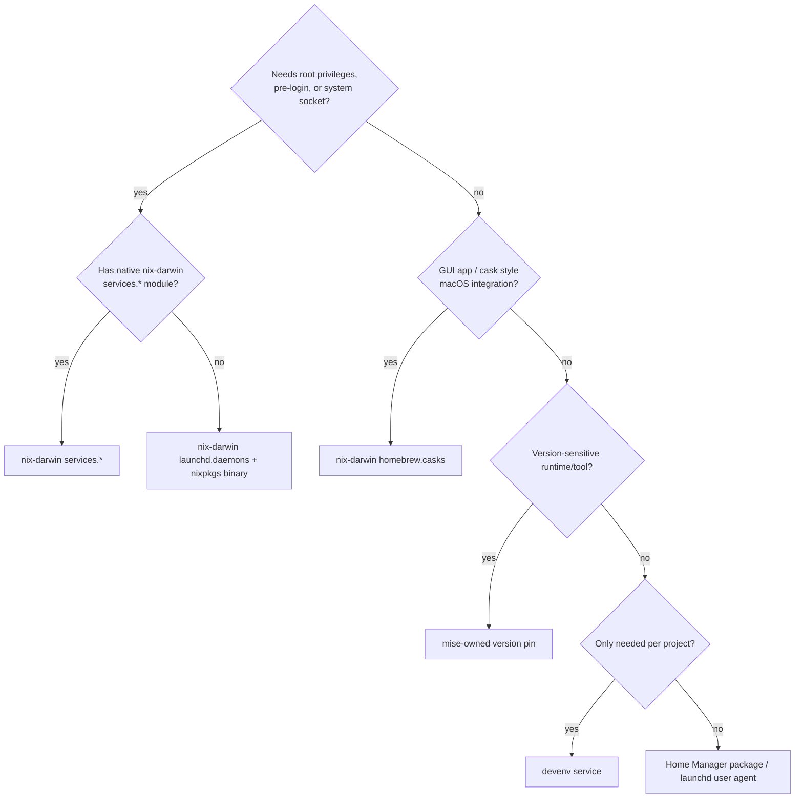

# Architecture Flows

This document captures the operational architecture used by this repo, with explicit ownership boundaries between nix-darwin, Home Manager, and mise.

## Layered Ownership

## Validation and Delivery Flow

## Decision Rule: Where a component belongs

