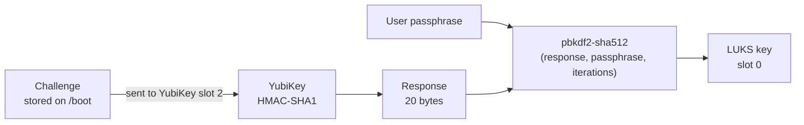
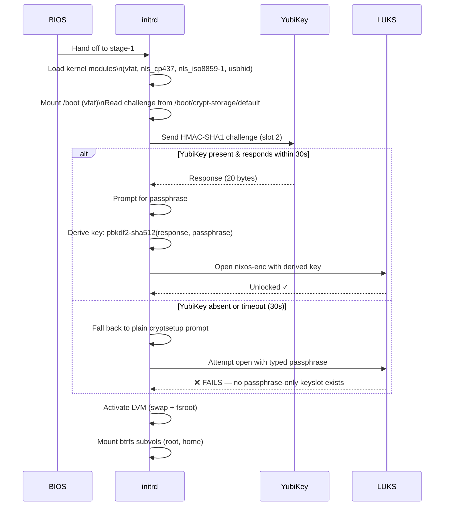
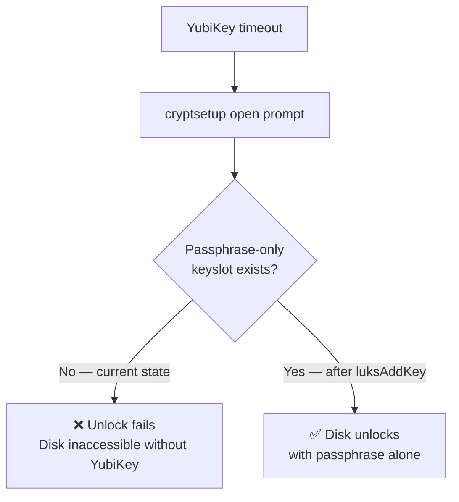

# Titan — Disk Encryption & YubiKey PBA

Framework Laptop 13 (AMD Ryzen 7840U). Full-disk encryption via LUKS2 + LVM on NVMe, unlocked at boot by a YubiKey HMAC-SHA1 challenge-response combined with a passphrase.

---

## Partition Layout

```
nvme0n1 (2TB)
├── nvme0n1p1  512MB   vfat    /boot (EFI) — also stores the YubiKey challenge
└── nvme0n1p2  ~2TB    LUKS2   nixos-enc
                          └── LVM (partitions)
                                ├── partitions-swap   8GB   swap
                                └── partitions-fsroot ~2TB  btrfs
                                                        ├── subvol=root  →  /
                                                        └── subvol=home  →  /home
```

---

## How the YubiKey Unlock Works

### Key derivation (`twoFactor = true`)

The single LUKS keyslot (slot 0) does **not** store your passphrase directly. It stores a key derived from **both** the YubiKey response and your passphrase:



> **Critical:** Neither the passphrase alone nor the YubiKey response alone can unlock the disk. Both are required inputs to derive the LUKS key.

### Boot sequence



---

## The Fallback Problem

When the YubiKey times out, the initrd shows a passphrase prompt. This is misleading — **it will not succeed** because:

- There is only **one LUKS keyslot** (slot 0)
- Slot 0 holds `pbkdf2-sha512(yubikey_response, passphrase)` — the combined key
- A plain passphrase does not match this key



### Adding a real passphrase fallback

To enroll a standalone passphrase as a second keyslot:

```bash
sudo cryptsetup luksAddKey /dev/nvme0n1p2
# Enter any existing passphrase to authenticate, then set the new fallback passphrase
```

Verify:

```bash
sudo cryptsetup luksDump /dev/nvme0n1p2 | grep -A1 "Keyslots"
# Should show slot 0 and slot 1
```

---

## NixOS Configuration Summary

```
boot.initrd.luks.yubikeySupport = true

boot.initrd.luks.devices."nixos-enc" = {
  device     = "/dev/nvme0n1p2"
  preLVM     = true          # LUKS wraps LVM
  yubikey = {
    slot        = 2          # HMAC-SHA1 slot on the YubiKey
    twoFactor   = true       # Requires both YubiKey response AND passphrase
    gracePeriod = 30         # Seconds to wait for YubiKey before fallback prompt
    storage.device = "/dev/nvme0n1p1"  # EFI partition holds the challenge file
  }
}
```

The challenge file lives at `/boot/crypt-storage/default` and contains a hex challenge string + PBKDF2 iteration count.

---

## References

- [NixOS Wiki — YubiKey FDE](https://wiki.nixos.org/wiki/Yubikey_based_Full_Disk_Encryption_(FDE)_on_NixOS)
- [nixpkgs luksroot.nix source](https://github.com/NixOS/nixpkgs/blob/master/nixos/modules/system/boot/luksroot.nix)
